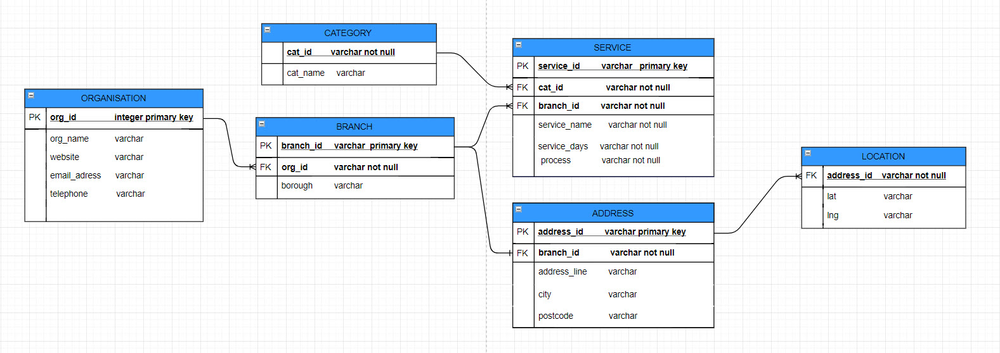

# Directory of Services 

[](https://circleci.com/gh/CodeYourFuture/directory-of-services/tree/master)

This is the Directory of Services project live at [https://dos.codeyourfuture.io](https://dos.codeyourfuture.io)


This App is destined primary for case workers who provide services oriented for refugees, asylum seekers and organisations working with them to identify services that offer advice and support to assist refugees and asylum seekers rebuild, improve their lives and facilitate their insertion inside the society.

## Getting Started


* This repo is frontend and backend
* It requires NODE
* This app is built with:
REACT 
Material UI
SQLITE for database...

## Database Schema



## Installing

Install project dependencies:

```sh
yarn
```

Run project locally:

```sh
cd frontend && yarn start
cd backend && yarn start
```

## License

This project is licensed under the MIT License - see the [LICENSE](./LICENSE)(LICENSE.md) file for details

## Acknowledgments

* Code Your Future mentors and students

